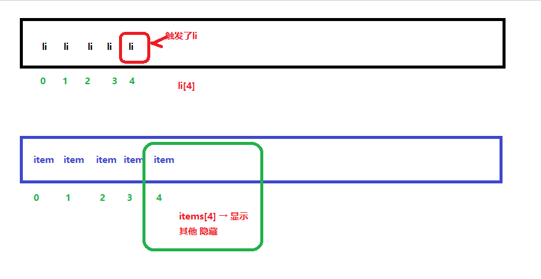

# webAPIs-day02

## 核心知识点

+ 设置元素的样式
+ 操作元素的属性（针对表单元素）
+ 节点的层级


## 补充1：根据选择器获取元素

+ 根据选择器获取单个元素

  + 语法：document.querySelector('选择器');

+ 根据选择器获取一组元素

  + 语法：document.querySelectorAll('选择器');

+ 代码：

  > ```html
  >   <button>按钮1</button>
  >   <button>按钮2</button>
  >   <button>按钮3</button>
  >   <script>
  >     // 根据选择器获取单个元素
  >     // 细节：若有多个标签选择器一样时，将来获取的是第一次出现的标签
  >     var btn = document.querySelector('button');
  >     console.log(btn);
  >
  >     // 根据选择器获取一组元素
  >     var btns = document.querySelectorAll('button');
  >     console.log(btns);
  >
  >   </script>
  > ```

> 注意：根据选择器获取元素的方式在ie8以下有兼容性问题


## 补充2：事件类型

+ onclick 鼠标点击

+ onmouseenter 鼠标进入元素事件

+ onmouseleave  鼠标离开元素事件

+ 代码：

  > ```html
  >   <div></div>
  >   <script>
  >     var div = document.querySelector('div');
  >
  >     div.onmouseenter = function() {
  >       console.log('鼠标进入了div');
  >     };
  >     div.onmouseleave = function() {
  >       console.log('鼠标离开了div');
  >     };
  >   </script>
  > ```


## 1. 操作元素的样式

### 1.1 通过style属性设置样式

+ 语法：元素.style.样式属性名 = '样式属性值';

+ 代码：

  > ```html
  >   <div>111</div>
  >   <script>
  >     var div = document.querySelector('div');
  >     div.style.width = '300px';
  >     div.style.height = '300px';
  >     // background-color → backgroundColor
  >     div.style.backgroundColor = 'red';
  >     // div.style.fontSize = '50px';
  >     div.style.font = 'bold 50px "宋体"';
  >
  >     // 若操作少量的样式时，适合用style属性操作
  >   </script>
  > ```

### 1.2 通过className设置样式

+ 语法：元素.className = '类名'

+ 代码：

  > ```html
  >   <style>
  >     .a {
  >       width: 300px;
  >       height: 300px;
  >       background-color: red;
  >       font:bold 50px '宋体';
  >     }
  >     .b {
  >       width: 500px;
  >       height: 500px;
  >       background: purple;
  >     }
  >   </style>
  >     <div>111</div>
  >   <script>
  >     var div = document.querySelector('div');
  >     div.className = 'b';
  >     // 若操作多个样式属性时，用className管理比较合适
  >   </script>
  > ```

  ​

### 案例

1. 开关灯
2. 给一组li注册点击事件，鼠标点击那个li就弹出这个li在这一组中的索引位置。
3. tab栏切换
   


## 2.操作表单元素的属性

### 2.1 value 操作表单元素的内容

- 获取：==元素.value;== 返回字符串
- 设置：==元素.value = 值;== 

### 2.2 disabled 操作表单元素是否禁用

- 获取：==元素.disabled;==  返回布尔值（true→禁用，false→不禁用）;
- 设置：==元素.disabled = 布尔值;==

### 2.3 checked 操作表单元素是否选中

- 获取：==元素.checked;==  返回布尔值（true→选中，false→不选中）;
- 设置：==元素.checked = 布尔值;== 

### 2.4 selected 操作表单元素的是否选中

- 获取： ==元素.selected;== 
- 设置：==元素.selected = 布尔值;== 

### 案例：

1. 购物车页面中的商品数量文本框
2. 购物车的全选
3. 注册页面，选中同意复选框启用注册按钮【作业】


## 3. 自定义属性行内属性【了解】

+ 获取

  > + 语法：**元素.getAttribute(name);** 

+ 设置

  > + 语法：**元素.setAttribute(name,value);** 

+ 移除

  > + 语法：**元素.removeAttribute(name,value);** 


## 4. 节点的层级

+ 节点的关系

  + 嵌套关系
    + 父子
    + 祖孙
  + 并列关系
    + 兄弟

+ 根据子节点获取父节点

  > + 语法：**子节点.parentNode**  【重点】

+ 根据父节点获取子节点

  > + 语法：**父节点.childNodes;** 
  > + 语法：**父元素.children;**  【重点】
  > + 语法：**父节点.firstElementChild;** 
  > + 语法：**父节点.lastElementChild;** 

+ 节点的nodeType、nodeName、nodeValue的属性【了解】

  + nodeType 检测节点的类型
  + nodeName 检测标签的名称
  + nodeValue 检测文本节点的内容

+ 获取兄弟节点

  > + 获取下一个兄弟
  >   + 语法：**节点.nextElementSibling** 
  > + 获取上一个兄弟
  >   + 语法：**节点.previousElementSibling** 